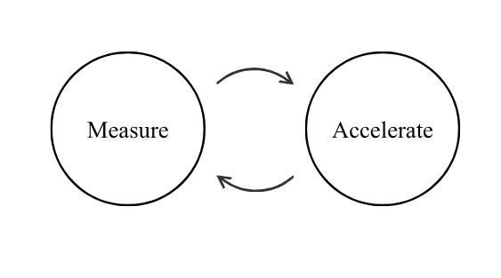
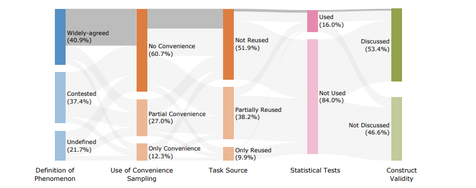

# Generality Labs

- We're the world's most outcome-obsessed R&D laboratory
- Our mission is to measure and accelerate scientific progress in AI safety

## What do you do?

We do two things:
1. **Monitoring & Evaluation:** we develop metrics and standards that clarify what progress looks like
2. **Product Development:** we build products that accelerate progress

## What are you currently working on?

**1. Standardising the AI evaluation ecosystem to bring it into line with scientific best practices**

*What does that mean?*
- All the evals, in one place, with outrageous amounts of metadata, which you can run and reconfigure however you want. They're also less broken
- Monthly deep dives into benchmarks, producing audit reports, public concern, and a bunch of new ways to measure the quality of evals

*Why are you doing it?*
- AI evaluations are the ground-truth scientific measurement tool for AI behaviour, upon which risk models, forecasts and mitigations are built - fixing evals is the necessary 1st step towards accelerating scientific progress
- To fix evals, we need to know what we're fixing (the audits) and then build the necessary tools & infrastructure to fix them (i.e. [Inspect Evals 2.0](https://github.com/UKGovernmentBEIS/inspect_evals))

**2. R&D for measuring scientific progress**

*What does that mean?*
- Research papers which show how you can measure the usefuless of other research papers
- Research products (e.g. nice dashboards, grand experiments) which show why you should care

*Why are you doing it?*

- Mitigate publication bias and prevent a replication crisis
    - Replicability crises emerge because scientific studies build compelling narratives from incomplete results ([humans are fundamentally biased towards making this mistake](https://www.google.com/search?q=%22what+you+see+is+all+there+is%22+WYSIATI&sca_esv=cd246a25237b15d7&rlz=1C1ONGR_en-GBAU1104AU1104&sxsrf=ANbL-n7mCM5WcS7gm-vgtVkfuL88WKn4iw%3A1776372374895&ei=lkrhaZuzNpe7hbIPpOyzmAk&biw=2276&bih=1092&ved=0ahUKEwib1pPjnvOTAxWXXUEAHST2DJMQ4dUDCBE&uact=5&oq=%22what+you+see+is+all+there+is%22+WYSIATI&gs_lp=Egxnd3Mtd2l6LXNlcnAiJiJ3aGF0IHlvdSBzZWUgaXMgYWxsIHRoZXJlIGlzIiBXWVNJQVRJSIJoUPIDWKJccAJ4AZABAJgBnwGgAZsKqgEEMTAuNLgBA8gBAPgBAZgCC6AC7wbCAgoQABiwAxjWBBhHwgIOEAAYsAMY5AIY1gTYAQHCAhcQLhiwAxi4BhjYAhjIAxjaBhjcBtgBAcICBRAAGIAEwgIGEAAYFhgewgILEAAYgAQYhgMYigXCAgUQABjvBcICBBAAGB7CAgYQABgHGB7CAgUQIRigAcICBRAhGJ8FwgIHECEYoAEYCpgDAIgGAZAGD7oGBggBEAEYCZIHAzYuNaAH8jyyBwM0LjW4B-cGwgcFMC40LjfIByGACAA&sclient=gws-wiz-serp))
    - The state of AI research is yet to learn important lessons from other fields; e.g. [most studies neglect](https://arxiv.org/pdf/2511.04703) basic precautions such as testing for statistical significance, and yet statistical rigour is just the [tip of the iceberg](https://www.google.com/search?q=Experiments+on+extrasensory+perception+bem&sca_esv=cd246a25237b15d7&rlz=1C1ONGR_en-GBAU1104AU1104&biw=2276&bih=1092&sxsrf=ANbL-n5KSExM137C-rieI8YbKuBBY0LUFw%3A1776371862113&ei=lkjhadLMBvWRhbIP5bSlqAM&ved=0ahUKEwjS79HunPOTAxX1SEEAHWVaCTUQ4dUDCBE&uact=5&oq=Experiments+on+extrasensory+perception+bem&gs_lp=Egxnd3Mtd2l6LXNlcnAiKkV4cGVyaW1lbnRzIG9uIGV4dHJhc2Vuc29yeSBwZXJjZXB0aW9uIGJlbTIFECEYoAEyBRAhGKABMgUQIRigATIFECEYoAFI7gVQjwRYjwRwAXgAkAEAmAGUAaAB4gGqAQMxLjG4AQPIAQD4AQGYAgKgAqMBwgIKEAAYsAMY1gQYR8ICDhAAGLADGOQCGNYE2AEBwgIXEC4YsAMYuAYY2AIYyAMY2gYY3AbYAQGYAwCIBgGQBg-6BgYIARABGAmSBwMxLjGgB_kWsgcDMC4xuAeaAcIHBTAuMS4xyAcIgAgA&sclient=gws-wiz-serp)
- Once we've learned how to do science, and measure that we're doing it right, we can then automate scientific progress
    - Agents and humans both do their best work when they have clear metrics & feedback signals
 
Figure: Bean et al. (2025) show that only ~16% of 445 LLM benchmarks used statistical tests when reporting results

## Why are you working on this?

We exist because the science of understanding AI isn't moving fast enough.

Our mission is to measure and accelerate scientific progress in AI safety

Our vision is an AI safety research ecosystem which:
1. Prioritises actions using **objective feedback**; this involves:
   1. Quantifying the effectiveness and utilisation of research methodologies and infrastructure
   2. Benchmarking scientific outputs according to ideals such as generality, replicability and predictive accuracy
  
2. **Learns from past scientific efforts** (both failures and success stories); this includes:
   1. Drawing inspiration from tools & methodologies which have been developed to solve similar problems that AI safety must overcome
   2. Avoiding foreseeable hurdles such as [publication bias](https://en.wikipedia.org/wiki/Publication_bias) and un-[FAIR](https://en.wikipedia.org/wiki/FAIR_data) research outputs
      
3. Demonstrates **strategic foresight**, with a preference for proactive rather than reactive problem solving; for example:
   1. Deliberately aligning incentives towards collectively beneficial outcomes
   2. Building research infrastructure and methodologies to maximally leverage the capabilities of AI systems for automation
  

---

We take our name from a highly influential work titled [*Tactics of Scientific Research*](https://drive.google.com/file/d/17HbK5DxLttYZJpumJ9BHnNkb5H6YV7_8/view?usp=sharing) (Sidman, 1960).

Sidman's methods are a case study in **scientific thinking and strategic foresight**, two principles we hope to bring to the field of AI safety.

His work was instrumental in preventing a [replication crisis](https://en.wikipedia.org/wiki/Replication_crisis) in his field of behavioural analysis - a phenomenon which has undermined the broader field of psychology and many other fields since

---

## Who are you?

We're a group of engineers and scientists, spinning off from [Arcadia Impact](https://www.arcadiaimpact.org/])

## How do I join?

If you're a scientist, engineer, or generalist who thinks that our mission is important and you have skills to bring, we beg you to introduce yourself via [this form](https://forms.gle/sFLHvksmC4Bq1D556)
